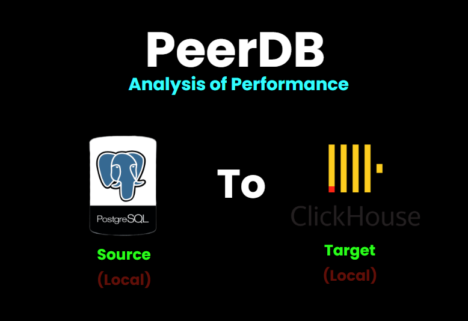

# PeerDB - Pipeline CDC (Change Data Capture) dan Analisis Performa


PeerDB adalah platform CDC (Change Data Capture) real-time yang memungkinkan replikasi data dari database PostgreSQL ke ClickHouse.

## 📁 Struktur Proyek

```
peerdb_psql_clickhouse/
├── docker-compose.yml                     # Konfigurasi container PeerDB
├── run-peerdb.sh                         # Script untuk menjalankan PeerDB
├── quickstart_prepare_peers.sh           # Script setup database
├── peerdb_insert.ps1                     # Script stress test INSERT
├── peerdb_psql_clickhouse_monitor.ps1    # Script monitoring pipeline
├── peerdb_config.yaml                    # Konfigurasi PeerDB
├── scripts/
│   └── setup-search-attributes.sh        # Setup search attributes
├── volumes/
│   ├── postgresql.conf                   # Konfigurasi PostgreSQL
│   ├── docker-entrypoint-initdb.d/       # Init scripts database
│   └── temporal-dynamicconfig/           # Konfigurasi Temporal
├── testing-results/                      # Folder hasil testing dan logs
└── README.md                             # Dokumentasi ini
```

## 🚀 Langkah Instalasi

### 1. Clone Repository

```bash
git clone https://github.com/khoirulamars/peerdb-cdc-psql-clickhouse
cd peerdb_psql_clickhouse
```

### 2. Pastikan Docker Berjalan

```powershell
docker --version
docker-compose --version
```

### 3. Setup

#### Jalankan PeerDB Stack

```powershell


# Jalanka Docker Compose
docker compose up -d

# Atau menggunakan script run-peerdb.sh (menggunakan WSL/Linux)
./run-peerdb.sh
```

**Output yang diharapkan:**
```
[+] Running 11/11
 ✔ Container catalog                    Healthy
 ✔ Container clickhouse                 Started
 ✔ Container peerdb-server              Started
 ✔ Container temporal                   Started
 ✔ Container peerdb-ui                  Started
 ✔ Container flow-worker                Started
 ✔ Container flow_api                   Started
 ...
```

#### Verifikasi Container Status

```powershell
docker ps
```

Pastikan semua container dalam status `Up` dan `healthy`.

#### Setup Database Source

```bash
./quickstart_prepare_peers.sh
```

Pastikan tidak terjadi error.

## 🔄 Membuat CDC Mirror

### 1. Setup Database
### 2. Akses UI dan Create Peer
1. **Akses UI**: Buka http://localhost:3000
2. **Create Peer**:
   - Klik "Add Peer"
   - **Source Peer (PostgreSQL)**:
     - Name: `postgres_source`
     - Type: PostgreSQL
     - Host: `catalog`
     - Port: `5432`
     - Database: `source`
     - Username: `postgres`
     - Password: `postgres`
     - Schema: `public`

   - **Target Peer (ClickHouse)**:
     - Name: `target`
     - Type: ClickHouse
     - Host: `clickhouse`
     - Port: `9000`
     - Database: `target`
     - Username: `default`
     - Password: `password123`
     - Disable TLS: aktif (hijau)

### 3. Validasi Peer
- Klik tombol "Validate Peer"
- Pastikan muncul status "Peer is valid"

### 4. Create Mirror
- Klik "Create Mirror"
- Source: `postgres_source`
- Target: `target`
- Tables: Pilih tabel yang akan direplikasi (contoh: `customers`, `products`, `orders`)
- Mirror Name: `postgres_to_clickhouse_mirror`


## 🧪 Testing Pipeline

### Jalankan Stress Test INSERT

```powershell
# Test basic (100 records, batch 10)
.\peerdb_insert.ps1 -RecordCount 100 -BatchSize 10 -ShowProgress

# Test dengan parameter custom
.\peerdb_insert.ps1 -RecordCount 1000 -BatchSize 50 -DelayBetweenBatches 2 -ShowProgress

# Test performa tinggi
.\peerdb_insert.ps1 -RecordCount 5000 -BatchSize 500 -DelayBetweenBatches 1
```

**Parameter yang tersedia:**
- `-RecordCount`: Jumlah record yang akan diinsert (default: 5000)
- `-BatchSize`: Ukuran batch per transaksi (default: 500)
- `-DelayBetweenBatches`: Delay antar batch dalam detik (default: 1)
- `-ShowProgress`: Menampilkan progress detail

**Output yang diharapkan:**
```
[17:41:09] PeerDB CDC Pipeline INSERT Stress Test
[17:41:09] Test ID: 2025-09-02-17-41-09
[17:41:09] Target Records: 5000
[17:41:09] Batch Size: 10
[17:41:09] Success Rate: 100%
[17:41:09] Throughput: 1.04 operations/second
```

### File Log yang Dihasilkan

- **Stress Test Log**: `testing-results/peerdb-stress-test-[timestamp].log`
- **Resource Usage Log**: `testing-results/peerdb-resource-usage-[timestamp].log`

## 📊 Monitoring

### Jalankan Script Monitoring

```powershell
.\peerdb_psql_clickhouse_monitor.ps1
```

**Pilihan monitoring:**
- **[A] Auto-select**: Otomatis memilih file log terbaru
- **[M] Manual**: Pilih file log secara manual
- **[Q] Quit**: Keluar dari monitoring

### Informasi yang Dipantau

1. **System Resource Usage**: CPU, Memory, Container stats
2. **Server Health Check**: Status koneksi database
3. **Table Statistics**: Jumlah row, ukuran tabel source vs target
4. **Flow Analysis**: Status CDC replication
5. **Operations Analysis**: INSERT/UPDATE/DELETE operations
6. **Container Health**: Status semua container Docker
7. **Performance Summary**: Ringkasan performa pipeline
8. **Database Metrics**: Metrik performa PostgreSQL dan ClickHouse
9. **Flow Health**: Kesehatan konfigurasi CDC
10. **Analysis Summary**: Rekomendasi berdasarkan analisis

## 🐛 Troubleshooting

### 1. Container Tidak Start

```powershell
# Cek status container
docker ps -a

# Cek logs container bermasalah
docker logs <container_name>

# Restart container
docker restart <container_name>
```

### 2. Database Connection Error

**PostgreSQL:**
```powershell
# Test koneksi ke catalog
docker exec catalog psql -U postgres -d postgres -c "SELECT 1;"

# Cek apakah database source sudah dibuat
docker exec catalog psql -U postgres -d postgres -c "\l"
```

**ClickHouse:**
```powershell
# Test koneksi ke ClickHouse
docker exec clickhouse clickhouse-client --query "SELECT 1"

# Cek database target
docker exec clickhouse clickhouse-client --query "SHOW DATABASES"
```

### 3. UI Tidak Accessible

```powershell
# Cek status container UI
docker ps | grep peerdb-ui

# Restart container UI
docker restart peerdb-ui

# Cek logs UI
docker logs peerdb-ui
```

### 4. CDC Replication Tidak Berjalan

1. **Cek di PeerDB UI**: Pastikan mirror sudah dibuat dan started
2. **Cek WAL Level**: Database PostgreSQL harus menggunakan `wal_level = logical`
3. **Cek Replication Slots**: 
   ```sql
   SELECT * FROM pg_replication_slots;
   ```
4. **Cek Search Attributes**: Pastikan MirrorName search attribute sudah ditambahkan

### 5. Peer Validation Error

**Jika "Peer is not valid":**
- Cek host/port, pastikan service berjalan (`docker ps`)
- Cek username/password
- Cek database/schema sudah dibuat
- Untuk ClickHouse, pastikan user `default` punya password dan database `target` sudah ada

### 6. Reset Complete Environment

```powershell
# Stop semua container
docker compose down

# Hapus volume (WARNING: Akan menghapus semua data)
docker compose down -v

# Restart clean
docker compose up -d
```

## 🔄 Workflow CDC

1. **Data Insert** ke database PostgreSQL source
2. **PostgreSQL WAL** menangkap perubahan
3. **PeerDB Flow Worker** membaca WAL
4. **Temporal Workflow** mengatur replikasi
5. **Data Transformation** (jika diperlukan)
6. **Data Replicated** ke ClickHouse target
7. **Monitoring** melacak status dan performa

## 📞 Support

Jika mengalami masalah:

1. Jalankan monitoring script untuk diagnosis
2. Cek logs di folder `testing-results/`
3. Periksa status container dengan `docker ps`
4. Akses PeerDB UI untuk visual monitoring
5. Cek Temporal UI untuk workflow status

---
